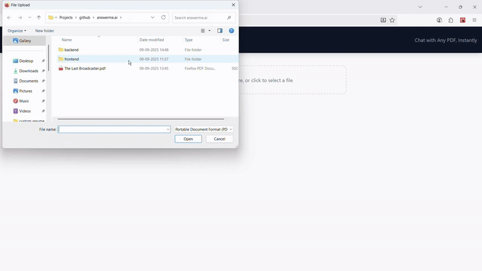

# Answerme.ai 

> A web application that allows you to chat with your PDF documents. It leverages a locally-run Large Language Model (LLM) to provide answers based exclusively on the content of your files, ensuring privacy and eliminating AI hallucinations.

- **Chat with Your Documents:** Upload any PDF and start a conversation to extract information, summarize content, or find specific details.
- **Ground-Truthed Answers:** The AI generates answers solely from the provided document, citing the source page for each claim. This prevents the model from inventing information.
- **Privacy First:** By using Ollama to run the LLM on your own machine, none of your documents or questions are sent to a third-party cloud service.
- **Modern Chat Experience:** The interface features a clean, modern design with a conversational history, source referencing, and a persistent memory for your documents.
- **Efficient Caching:** The backend intelligently caches processed PDFs. After the first upload, subsequent sessions with the same document are nearly instantaneous.

## Demo



## Table of Contents

1. [Tech Stack and Prerequisites](#1-tech-stack-and-prerequisites)
2. [How to Install and Run the Project](#2-how-to-install-and-run-the-project)
3. [How to Use the Project](#3-how-to-use-the-project)
4. [Future Improvements](#4-future-improvements)
5. [Acknowledgements](#5-acknowledgements)
6. [License](#6-license)

## 1. Tech Stack and Prerequisites

**Frontend:** React, Tailwind CSS, React Dropzone\
**Backend:** Flask, LangChain, Ollama, FAISS\
**Prerequisites:** Python, Node.js and npm, Ollama

## 2. How to Install and Run the Project

**1. Clone the Repository:**
```
git clone https://github.com/aursalan/answerme.ai.git
cd answerme-ai
```

**2. Set Up the Backend:**
- Navigate to the `backend` directory.
```
cd backend
```

- Create and activate a Python virtual environment.
```
# For macOS/Linux
python3 -m venv venv
source venv/bin/activate

# For Windows
python -m venv venv
.\venv\Scripts\activate
```

- Install the required Python packages.
``` 
pip install -r requirements.txt
```

**3. Set Up the Frontend:**
- In a new terminal, navigate to the `frontend` directory.
```
cd frontend 
```

- Install the required npm packages.
``` 
npm install
```

**4. Run the Application:**

You will need three separate terminals running simultaneously.

- Terminal 1: Start Ollama
First, ensure the Ollama application is running. Then, pull the model you wish to use (e.g., llama2).
```
ollama pull llama2 
```

- Terminal 2: Start the Backend Server:
In your `backend` directory (with the virtual environment activated):
```
python server.py 
```

- Terminal 3: Start the Frontend Application
In your `frontend` directory:
```
npm run dev
```

Open your web browser and navigate to http://localhost:5173.
 
## 3. How to Use the Project

- **Upload a PDF:** Drag and drop your PDF file into the designated area or click to select it.
- **Wait for Processing:** The app will process and index the document. Thanks to caching, this will be instant for previously used files.
- **Ask a Question:** Once ready, type a question about the PDF's content into the chat input at the bottom and press Enter.
- **Review the Answer:** The AI's response will appear in the chat window. Below the answer, you can find the source snippets from the document that were used to generate the response.
- **Continue the Conversation:** Ask follow-up questions to dive deeper.
- **Start Over:** Click on the uploaded PDF to upload a new document and start over again.

##  4. Future Improvements

This project has a solid foundation, but there are many potential enhancements:

- **Support for More File Types:** Extend the backend to handle .docx, .txt, and URLs.
- **Multi-Document Chat:** Allow users to upload multiple documents and ask questions across the entire corpus.
- **Cloud Deployment:** Adapt the application to use a hosted LLM API for users without powerful local hardware.
- **User-Selectable Models:** Add a dropdown menu in the UI to allow users to switch between different Ollama models.

## 5. Acknowledgements

- [React Documentation](https://react.dev/)
- [Tailwind CSS Documentation](https://tailwindcss.com/docs/installation)
- [Flask Documentation](https://flask.palletsprojects.com/)
- [LangChain Documentation](https://python.langchain.com/docs/get_started/introduction)
- [Ollama Documentation](https://www.google.com/search?q=https://github.com/ollama/ollama/blob/main/docs/README.md)
- [FAISS GitHub Repository](https://github.com/facebookresearch/faiss)

## 6. License

This project is licensed under the [MIT](LICENSE) License.
